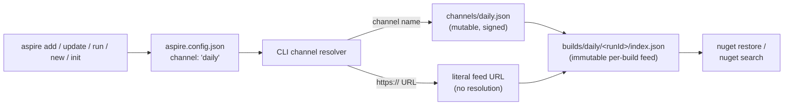

# Per-build static NuGet feeds for the Aspire CLI

> **Status:** design proposal. Captures the **why** and **what** of a
> redesign of how the Aspire CLI discovers and resolves NuGet packages
> across channels (`stable`, `staging`, `daily`, `pr-<N>`, `local`).
> The **how** — file-level changes, code organization, exact pipeline
> YAML, migration order — is intentionally deferred to implementation
> time.

## TL;DR

Today the Aspire CLI resolves NuGet packages through five different
channel-specific code paths: nuget.org for stable; a shared rolling
`dnceng/public/_packaging/dotnet9` feed for daily; a SHA-derived
`darc-pub-microsoft-aspire-<sha>` feed for staging (only synthesizable
on stable-quality CLIs); a GitHub-Actions-artifact-plus-local-hive
scheme for PRs (via `gh run download`); and a `~/.aspire/hives/*/packages`
sideload for local. Resolution depends on the CLI's baked identity,
the project channel, feature flags, override config, and the CLI
version's commit hash, with quality-matrix fan-out behind it.

This spec replaces all five with **one** code path. Every Aspire CI
build — PR, main, release/\*, GA — publishes a complete, immutable,
static NuGet v3 feed to public Azure Blob storage at a per-build URL.
The existing channel names (`daily`, `staging`, `pr-1234`, etc.) keep
working but now resolve through small mutable **pointer files** that
name the current per-build feed URL for that channel. The CLI's job
collapses to "fetch pointer file → use the URL it names." Almost all
of today's channel-resolution machinery — the quality matrix, staging
synthesis gating, SHA extraction, PR hive discovery, local hive
sideload, override config keys — is then deletable.



## Why we're doing this

### The current model is the single largest source of late-stage
### shipping bugs

The packaging service and channel resolver are the area of the CLI
most likely to break a release at the last mile. Concretely:

- **Channel resolution is context-dependent.** What `channel: "daily"`
  resolves to depends on the CLI's baked identity channel, project
  channel, feature flags, override config, *and* the CLI version's
  commit hash. There are too many inputs that interact non-obviously.
- **Some channels are conditionally synthesizable.** The `staging`
  channel only works on CLIs whose identity is `stable`, because the
  underlying SHA-specific feed only exists for stable-quality builds.
  A daily or PR CLI cannot deterministically resolve `staging` — a
  recurring shipping bug that we've gated, worked around, and
  reintroduced multiple times.
- **The `daily` channel is a shared rolling feed.** A CLI from
  yesterday's daily silently sees packages from today's daily unless
  we pin. There is no per-build immutability for daily.
- **PR builds use a separate file-system mechanism** (install-prefix
  hives) discovered by string-matching on the CLI's process path. A
  parallel resolution path that has its own bugs and operational
  quirks.
- **`local` builds rely on `~/.aspire/hives/<name>/packages`**
  sideloading. Another separate code path.
- **The on-disk channel name persists, not the actual feed URL**, so
  the same `aspire.config.json` resolves differently depending on
  which CLI happens to be installed on a given machine.
- **Every escape hatch grew from one of these channel quirks.** A
  prerelease semver filter to deal with rolling daily; a staging
  pinning override; a SHA-extraction helper; a staging-feed override
  config key; a quality-matrix enum used for fan-out and filtering.
  These are not bad code; they are the right code for the wrong
  underlying model.

### The cost is paid by humans

- **Shiproom risk.** Late-cycle "I can't resolve staging from this
  CLI" bugs derail RC reviews, because we discover them when teams
  try to dogfood RC bits with a daily-channel CLI. Resolving them
  often requires pulling in multiple team members with specialist
  skills (CLI internals, Maestro/darc, AzDO release pipelines,
  storage / feed ACLs), and the access controls on the underlying
  systems are segmented across roles — so progress frequently
  stalls on timezone splits while waiting for the one person with
  the right permissions to come online.
- **Contributor friction.** "How do I test the bits from this PR?"
  is an `gh run download` + hive-copy + path-prefix dance that
  requires the `gh` CLI installed and authenticated. Codespaces,
  fresh containers, and external contributors hit avoidable
  obstacles.
- **Polyglot AppHosts inherit the complexity.** TypeScript / Python /
  Go AppHosts read `aspire.config.json#channel` at runtime and have
  to be handed a usable `NuGet.config`; the resolution complexity
  shows up in `Aspire.Managed` too.
- **Time spent.** A non-trivial fraction of every release cycle is
  spent debugging channel-resolution edge cases instead of shipping.

### What we want instead

A model where:

- **There is one resolution story.** PR, daily, staging, stable,
  local — all five behave identically as far as the CLI is concerned.
- **A local PR build is testable the same way a staging build is.**
  Same code path, same config shape, same network behavior.
- **`aspire.config.json` says exactly what packages the project
  resolves**, so a project's package source is reproducible across
  contributors and CI agents.
- **Adding a new channel does not require new branches in the CLI.**
  Channel names become pure indirection; behavior lives in storage.
  Local builds are not a separate code path either — they use the
  same "per-build path recorded in the CLI's identity file" pattern
  as PR builds, with `file://` instead of `https://` as the URL
  scheme. The resolver does not branch on scheme; NuGet handles
  both transparently.
- **What ships to nuget.org is the exact bytes that were tested in
  staging.** No "we tested an RC and rebuilt for GA" risk.

## What we're going to do

### 1. Every build publishes its own static NuGet v3 feed

Every successful CI build — PR builds, daily main builds, release/\*
builds, GA stable builds — uploads its NuGet packages, laid out as a
complete static v3 feed (service index + flat-container layout), to
a per-build, **immutable** path in public Azure Blob storage. The
feed is anonymously readable; standard NuGet clients can use it as a
source directly with no auth.

A "feed" here is just a directory of files; there is no server, no
auth, no database, no service to operate. Per-build immutability
means an exact `<channel>-<runId>` path will return the same bytes
forever (or until retention reclaims it).

`<runId>` throughout this document is used as a shorthand for a
**composite identifier that uniquely names a single build attempt
on a single build system**, not a raw integer from any one provider.
The build pipeline computes it from the inputs the source pipeline
already exposes, and the publish workflow uses the same recipe to
derive the destination path so a PR cannot spoof it. Concretely we
need to handle both supported build systems:

- **GitHub Actions**: composite of `github.run_id` +
  `github.run_attempt` (so re-runs of the same workflow land at
  distinct paths and never collide), prefixed with `gh-` to
  disambiguate from AzDO ids. For example
  `gh-<run_id>-<run_attempt>`.
- **Azure DevOps**: composite of the AzDO build id + the rerun
  attempt counter (AzDO exposes both, and reruns produce distinct
  attempt values). Prefixed with `ado-` to disambiguate. For
  example `ado-<buildId>-<attempt>`.

This prefix-plus-composite scheme guarantees uniqueness across the
two systems (no risk of a GH run id colliding with an AzDO build id
that happens to share the same number) and across reruns within
each system. Exact strings are an implementation detail and may
change, but the property the rest of the spec depends on is that
**every build attempt — including reruns — has its own immutable
path** and that the path is **deterministically derivable** from
identifiers the upstream build system signs into its OIDC token, so
the publish workflow can re-compute and validate it without
trusting any PR-modifiable input.

### 2. Channel names resolve through small pointer files

The `channel` concept in `aspire.config.json` stays. The set of
well-known names stays (`stable`, `staging`, `daily`, `pr-<N>`,
`local`). What changes is that each well-known name maps to a
small, mutable **pointer file** in blob storage that names the
current per-build feed URL for that channel:

```jsonc
// channels/daily.json (overwritten on each successful main build)
{
  "feedUrl": "https://.../builds/daily/<runId>/index.json",
  "version": "13.5.0-daily.42",
  "publishedUtc": "...",
  "signed": true
}
```

The CLI's resolver becomes essentially "fetch pointer, follow its
URL." That's it.

### 3. The `channel` field becomes polymorphic

`channel` in `aspire.config.json` (and the `--channel` arg) accepts
either a well-known name (the existing vocabulary) **or** a literal
`https://` feed URL. Well-known names go through the pointer-file
resolver; URLs are used verbatim with no resolution step. Power
users and CI can pin to an exact build URL when they need to without
inventing a new channel name.

### 4. The CLI's identity is a co-located install-time config, not a baked binary attribute

Today the CLI's identity channel is baked into the binary as an
`[AssemblyMetadata("AspireCliChannel", "...")]` value at pack time,
which means the bits on disk are different per channel even when the
code is identical. That makes "fake a stable CLI from a staging
build" or "test a local CLI as if it were daily" require a rebuild.

In the new model the CLI binary is **identical regardless of channel**,
and its identity is read from a small **co-located configuration file**
written next to the CLI executable at install time (a separate file,
**not** `aspire.config.json`; working name e.g.
`aspire-cli.identity.json`). The file records which channel produced
this install, the corresponding default feed URL, and any
local-build-specific fields (e.g. `file://` URL for `local`).

This co-located file's only role is to provide a sensible default
for `aspire new` / `aspire init` when the user hasn't picked one,
plus the diagnostic context shown in `aspire doctor`. It no longer
controls *whether* a channel can be resolved or *how*. A
daily-installed CLI can resolve `staging` perfectly fine because
pointer files exist for every channel.

The "no binary difference" property has concrete payoffs:

- **Easier debugging of fake stable / staging builds locally.** A
  developer or release engineer can copy a daily-built CLI to a
  scratch directory, drop in a hand-written
  `aspire-cli.identity.json` claiming `"channel": "stable"`, and
  reproduce stable-channel default behavior without recompiling.
  Useful for reproducing customer-reported scaffolding issues
  without the full build cycle.
- **Same artifact ships across channels.** The acquisition scripts
  and installers download one set of CLI bits per RID / version and
  write the identity file as a side effect of installation,
  rather than us shipping N parallel near-identical archives.
- **Easier supply-chain reasoning.** The bytes verified by NuGet /
  attestations / Authenticode are the same regardless of channel,
  so cross-channel reproducibility checks become trivial.

`local` is still handled separately — see section 9 below — but
even the local case becomes "the local pack step writes the
`aspire-cli.identity.json` with `channel: "local"` and a `file://`
URL" rather than baking metadata.

### 5. Channel config is two-tiered: local for projects, global for scaffolding

Resolution is two-tiered with command-line override on top:

- **Local `aspire.config.json`** (committed at the project / AppHost
  root): authoritative for commands that operate within an existing
  project — `aspire add`, `aspire update`, `aspire run` / `start`.
  A team commits `"channel": "daily"` (or a specific PR / build URL)
  and every contributor's CLI resolves the same packages.
- **Global `aspire.config.json`** (user-scoped): provides the
  default channel for scaffolding commands — `aspire new`,
  `aspire init` — so the user doesn't have to pass `--channel`
  every time. Falls back to the channel recorded in the CLI's
  co-located install-time identity file (see §4) if no global
  config exists yet.
- **Command-line `--channel <v>`** always wins for the single
  invocation.

The existing `aspire config` command keeps its existing semantics:
`aspire config set channel <v>` edits the local file;
`aspire config set -g channel <v>` edits the global file. `<v>`
accepts a well-known channel name **or** a literal `https://` feed URL.

`aspire update --channel <v>` is special: if `<v>` differs from the
current local `aspire.config.json#channel`, `update` rewrites the
local file's `channel` to `<v>` as part of the update — switching
channels *is* what `update` means in that case. For C# AppHosts the
rest of `update` (bumping package references) then runs against the
resolved feed; for polyglot AppHosts the channel switch is itself
the update.

### 6. Promote-not-rebuild for staging → stable

In the per-build-feed world, the `staging` and `stable` pipelines
can collapse into a **single signed-bits pipeline** whose only
end-of-pipeline decision is *"do we also push to nuget.org?"*. The
nupkgs are identical bytes throughout.

- Release-branch build produces signed `*.nupkg` files once and
  publishes them to `builds/staging/<runId>/`. Those bytes become
  the staging feed.
- Soak / QA / shiproom runs against those exact immutable bytes;
  there is no separate rebuild for "RC" vs "GA".
- A gated promotion pipeline does a server-side blob copy from
  `builds/staging/<runId>/` to `builds/stable/<version>/`, flips
  `channels/stable.json`, and pushes the *same bytes* to nuget.org.
- The "did we test the right bits?" risk that today exists because
  staging and stable are technically separate builds disappears
  entirely. The bytes that ship to nuget.org are bit-for-bit the
  bytes that were soaked in staging.

The staging build is stamped with the prospective GA version up
front. **Per-build path isolation makes that safe**: every build
lives at a unique `builds/staging/<runId>/...` path, so two
candidates both stamped `13.5.0` live at completely separate URLs
and never collide on blob. `channels/staging.json` simply points at
the latest successful candidate; a rejected candidate's bytes
persist at their original URL as a forensic artifact but stop being
discoverable via the channel name. The version number can be re-used
on the next candidate.

The only remaining caveat is downstream NuGet caches: a developer
who pulled the rejected `13.5.0` from staging during the soak window
has those bytes cached locally and may need a `dotnet nuget locals`
clear after a recall. This is normal NuGet behavior any time the
bytes of a given `(id, version)` change. The CLI can help by
surfacing recall information in `aspire doctor` and optionally
clearing affected cache entries proactively.

Earlier RC milestones (where prerelease semver actually matters to
users) still pack with an explicit `--prerelease-suffix rc.N`-style
mode. Those builds are normal prereleases, not GA promotion
candidates, and follow regular NuGet versioning rules.

### 7. The acquisition scripts simplify and drop the `gh` dependency

Today `get-aspire-cli-pr.sh` shells out to `gh run download` to
fetch a PR's CLI archive and packages from GitHub Actions
artifacts. That requires the `gh` CLI to be installed and
authenticated on the user's machine — a friction point for anyone
on a fresh box, a Codespace without `gh`, or a CI agent lacking
GitHub auth.

With the public blob feed, every PR's archive and package feed lives
at plain public HTTPS URLs resolvable via `channels/pr-<N>.json`.
The acquisition scripts can use `curl` / `Invoke-WebRequest` only.
No GitHub auth, no GitHub-API rate limits, no `gh` install step in
Codespace / dev container setup, no `actions:read` permission
gotchas.

### 8. Stable defaults to nuget.org; blob feed is opt-in for stable

GA users keep resolving stable packages from nuget.org by default.
The pointer file `channels/stable.json` exists (so we can dogfood /
QA the stable build via the blob path), but a stable-channel CLI
only routes through it when the user explicitly opts in via a
global CLI setting. PR / daily / staging / local channels always
route through the blob.

### 9. Local hives become first-class — and naturally support concurrent agentic development

Local-developer builds and the implicit
`~/.aspire/hives/<name>/packages` sideload scheme go away in their
current form, but the **capability** they provide — pointing the CLI
at a developer-built feed without going through the network — is
preserved and substantially expanded, because the polymorphic
`channel` field already accepts arbitrary URLs and `file://` is a
URL.

**Local builds are just PR builds with a different URL scheme.**

The core insight is that we can treat a local developer build
exactly the way we treat a PR build today: copy the produced feed
into a unique per-build path and record that path in the CLI's
identity. The only difference is the URL scheme — `file://` instead
of `https://` — and the resolver does not need to care.

A developer build emits a static NuGet v3 feed into a per-worktree
path such as `<worktree>/artifacts/packages/<config>/Shipping/feed/`
(same layout the blob publisher uses; nothing blob-specific about the
layout). The local pack step then writes the locally-installed CLI's
co-located `aspire-cli.identity.json` (see §4) so it points directly
at that path:

```jsonc
{
  "channel": "local",
  "feedUrl": "file:///work/aspire-worktree-a/artifacts/packages/Debug/Shipping/feed/"
}
```

There is no machine-global "active hive" selection step, no implicit
directory sniffing, no install-prefix probing. The CLI knows where
its packages live because its identity file says so, exactly the way
a PR CLI's identity file says
`https://.../builds/pr-1234/gh-...-1/feed/`.

**Concurrent worktrees / agents fall out for free.**

Because the identity file lives next to the CLI binary in each
worktree's local install location, the same machine can host any
number of independent local feeds simultaneously — one per
worktree, one per agent. Each worktree's locally-installed CLI is
self-contained; it has its own identity, its own `file://` feed
URL, and its own packages on disk. There is no shared ambient state
to fight over and no exclusive "the active hive" concept the way
today's `~/.aspire/hives` selection implies.

Projects scaffolded by such a CLI pin to that CLI's feed URL via
the per-project `aspire.config.json`, so the project remains
reproducible against that exact feed even if the CLI is later
replaced.

For ad-hoc cases where a user wants to point at a local feed they
did not build themselves (e.g. consuming a teammate's worktree),
the same polymorphic `channel` field accepts the URL directly:
`"channel": "file:///some/other/feed"` or `--channel <file-url>`
on a single command. No registration step; the URL is the
identifier.

**Why this matters for concurrent agentic development.**

Coding agents routinely operate in parallel worktrees of the same
repo, each at a different commit, each producing different bytes
for the same `(packageId, version)`. Today's hive scheme has a
machine-global selection step that makes those worktrees collide
on shared state (last writer wins, cache poisoning across agents,
"why is agent B suddenly seeing agent A's packages?" bugs).

In the new model the **per-project `aspire.config.json` is the
selector**, and each worktree's scaffolded project has its own
pinned `file://` URL. Agents can run dozens of concurrent
worktrees with independent package realities and no cross-talk,
because nothing in the resolution path consults global ambient
state — the project file fully determines the feed URL, and the
feed URL fully determines the bytes.

**NuGet cache hygiene applies the same way it always does.** Two
worktrees both producing `Aspire.Hosting 13.5.0-dev` from
different bytes will trip NuGet's cache by `(id, version)`, the
same hazard called out for staging recalls earlier in this doc.
The recommended pattern is to stamp local-build versions with a
worktree-unique suffix (e.g. `13.5.0-dev.<shortSha>` or
`13.5.0-dev.<worktreeId>`) so each worktree's feed carries a
distinct version. The CLI can default this behavior in the
local-build pack target and surface a warning in `aspire doctor`
when two registered local feeds publish the same `(id, version)`
with different digests.

**What goes away vs. what's preserved.**

- *Goes away*: the implicit `~/.aspire/hives/<name>/packages`
  sideload, the install-prefix process-path string-matching used
  for PR-hive discovery, the resolution branching that picks
  between "feed" and "hive" code paths.
- *Preserved and improved*: pointing the CLI at locally built
  bits without network round-trips, scaffolding new projects with
  a local-built CLI, switching between local builds, *plus* the
  new ability to run an arbitrary number of independent local
  hives concurrently with no shared state.

## Why the simplifications follow

Once channels resolve through a single pointer-file lookup:

- **Channel quality matrix goes away.** `PackageChannelQuality`,
  `PackageChannelType`, and the fan-out logic across packaging
  service methods have no purpose; channels are just names that map
  to URLs.
- **Staging-synthesis gating goes away.** A daily CLI resolves
  `staging` the same way it resolves `daily`: by fetching a
  pointer file. The whole `IsStagingChannelSynthesisAllowed`
  family of checks deletes.
- **SHA-extraction from the CLI's own version string goes away.**
  The staging feed URL no longer depends on the CLI's commit hash.
- **The various staging-pinning / override config keys go away.**
  They exist today to work around the matrix; with no matrix,
  nothing to override.
- **The PR install-prefix hive scheme goes away.** PR resolution
  is `channels/pr-<N>.json`, same as everything else.
- **The `~/.aspire/hives/*/packages` discovery for local goes
  away.** Replaced by explicit `file://` URLs in `channel`, which
  also unlocks multiple concurrent local hives — see section 9.
- **Prerelease semver filtering inside the CLI goes away.** Each
  per-build feed contains exactly the versions that build produced;
  there is no rolling feed to filter.

The expected outcome is a packaging subsystem of roughly an order
of magnitude less code than today's, with one dominant code path
instead of five branching ones.

## Security: how we keep this from becoming a supply-chain hazard

A blob path that NuGet clients trust is a high-value target. The
design has to assume an attacker will try to subvert it through:

- A leaked credential in CI.
- A malicious PR that modifies a build YAML to push to an
  unexpected blob path.
- A compromised CI agent.
- An orphaned long-lived SAS token.
- A typo in a role assignment.

The redesign aims for the property that **no single failure mode**
can cause Aspire users to install a malicious package without
leaving an auditable trail. Key principles, in order of importance:

### Build pipelines never hold blob credentials

The pipelines that produce nupkgs (the same ones contributors edit
in PRs today) only emit the same GitHub / AzDO build artifacts
they already emit. They have no credential capable of writing to
blob storage.

A **separate, locked-down publish workflow** holds the sole
blob-write identity. It is triggered by completion of the build
pipeline (GH Actions `workflow_run` on success; AzDO equivalent),
runs from the default branch only, and is therefore not
PR-modifiable: a PR can change the build YAML but cannot change
the publish workflow, because the publish workflow always runs
from `main`'s copy of itself.

The publish workflow computes the destination blob path from
**trusted-only** inputs (workflow name, run id, PR number from the
upstream run's API record), not from any field a PR author can
spoof. It re-validates artifacts before publish.

### Federated identity, never static credentials

Both GH Actions and AzDO authenticate to Azure via federated
workload identity (OIDC). No storage account keys, no SAS tokens,
no service-principal secrets anywhere in pipeline variables, repo
secrets, or files. Trust policies on the storage account bind
specific OIDC subjects (specific workflow files, branches, source
repositories), so even another workflow in the same repo cannot
mint a token the storage account will accept.

Per-build-kind identities are separately scoped: a PR-publish
identity cannot write to `builds/stable/...`; only the GA-promotion
pipeline can.

### Storage account hardening (candidate controls)

The controls below are a menu of hardening measures to evaluate
against a holistic threat model rather than a fixed prescription.
Not all will be practical or compatible with one another, and the
final set has to be chosen by weighing operational cost (key
rotation, network-rule maintenance, CI egress IP churn, recovery
drills) against the actual attacker capabilities we are defending
against. The threat model itself is one of the open questions
below — these are the candidate mitigations once that model lands.

- Account-key auth disabled at the account level.
- SAS token generation disabled at the account level.
- No anonymous public access at the account level; the single
  read-only container opts in to anonymous *blob* read (not
  container listing).
- Network rules restrict writes to known CI egress.
- Resource lock prevents accidental deletion.
- Blob versioning + soft delete enable recovery from an
  accidental pointer overwrite.
- Immutability policy on stable-build paths prevents tampering
  with shipped GA bits after publish.

Each of these has tradeoffs: e.g. tight network rules on CI egress
fight with hosted-runner IP churn; immutability policies fight with
the ability to redact accidentally-published secrets; anonymous
blob read trades enumerability for unauthenticated reach. These
need to be evaluated together, not adopted individually.

### Pointer files are signed

Each `channels/<name>.json` pointer is signed with a Key-Vault-held
identity, and the CLI verifies the signature before honoring the
resolved URL against a baked allowlist of acceptable signer
thumbprints. A rotated or compromised signing key can be revoked
via a CLI update, without trusting blob storage to police itself.

An append-only pointer history under
`channels/<name>/history/<utcTimestamp>-<runId>.json` makes pointer
flips auditable and reversible.

### Provenance + visible audit

- SLSA-style build provenance attestations published alongside
  each feed and optionally verified by the CLI.
- `aspire doctor` surfaces the resolved feed URL, pointer signature
  subject, and provenance source — so a user or CI operator can
  audit exactly what the CLI just trusted.
- A periodic CI job diffs `channels/*.json` against the
  corresponding pipeline run history and pages out unexplained
  pointer flips.

### Read-path checks

- NuGet package signatures are verified the same way they are
  today against the existing trust roots.
- For PR builds (test-signed packages), the CLI surfaces a clear
  "test-signed feed" indicator.
- Pointer-file URLs are constrained to an allowlist of host
  patterns (known account + optional AFD fronting) so a hijacked
  pointer cannot redirect the CLI to an arbitrary domain.

This whole section is intended to be reviewed by .NET security
engineering before any blob is provisioned.

## Goals and non-goals

**Goals**

- One resolution code path that handles every channel identically.
- A local PR build is testable the same way a staging or GA build
  is.
- `aspire.config.json` is fully self-describing for package
  resolution: any CLI on any machine resolves the same packages.
- Bytes that ship to nuget.org for GA are bit-for-bit the bytes
  that were soaked in staging.
- The acquisition scripts have no GitHub-API dependency and need
  no auth.
- A clear, auditable security model for blob publish that survives
  a malicious PR or a compromised CI agent.

**Non-goals**

- We are not changing the `channel` vocabulary that users see;
  the existing names continue to work.
- We are not changing how NuGet itself works; we publish a standard
  v3 feed and let NuGet do its job.
- We are not adding a server, database, or API to manage feeds.
  Everything is static files in blob storage.
- We are not changing where stable packages live for GA users —
  nuget.org remains the default for stable.
- This proposal is **not** an implementation plan. It does not
  prescribe file paths, class names, MSBuild targets, pipeline YAML
  names, or migration ordering. Those are deliberately left to
  implementation time.

## Scope of impact (high-level)

What this design touches, broadly:

- **CLI packaging subsystem.** Substantial deletion plus a small
  new resolver and signed-pointer client. The bulk of the existing
  code becomes dead.
- **CLI commands.** `new`, `init`, `add`, `update`, `run` / `start`,
  and `doctor` all change behavior around channel inputs (per the
  two-tier config model above). `config` reuses its existing
  local-default / `-g`-global semantics.
- **`aspire.config.json` schema.** No new fields. `channel`'s value
  range widens to include literal `https://` URLs.
- **Polyglot AppHost runtime** (TS / Py / Go). They continue to
  read `channel` from `aspire.config.json`; the CLI hands them a
  materialized `NuGet.config` with the resolved feed.
- **Acquisition scripts.** `get-aspire-cli*.sh` / `.ps1` simplify;
  the PR variants drop their `gh` dependency.
- **CI / engineering system.** Build pipelines gain an artifact-emit
  step for the static feed layout (no new credentials). A new
  locked-down publish workflow is the sole holder of the blob-write
  identity and runs only from `main`. The staging and stable
  pipelines merge into one signed-bits pipeline with a gated
  promotion step.
- **Tests.** The existing packaging tests collapse dramatically;
  new tests cover the pointer-file resolver and the static-feed
  layout.
- **Infrastructure as code.** New IaC for the storage account,
  network rules, federated identity trust policies, retention /
  immutability rules, and signing-key vault — all reviewable in
  the repo.

What it does **not** touch:

- Resource model, AppHost APIs, dashboard, deployment, hosting
  integrations, or anything else outside the CLI's package
  resolution path.

## Open questions

These are decisions the implementation phase will need to make.
Recording them here so reviewers can challenge or constrain them
before we start writing code.

**Storage / infra**

- Storage account ownership: does this live in the existing
  `dotnetcli`-style tenant or a new dedicated account?
- Storage account region / CDN fronting strategy.
- Retention windows per build kind (PR, daily, staging, stable).

**Pointer files**

- Custom JSON pointer with metadata (signing, build id, published
  date) vs. literally hosting a NuGet v3 service index that
  redirects? The latter is simpler for NuGet but loses the metadata
  channel.
- Pointer-file caching policy on the CLI side: TTL, respect
  `Cache-Control`, user-visible bypass flag?
- Signing key: reuse existing NuGet signing identity or mint a
  dedicated pointer-signing identity for blast-radius isolation?
- Rotation cadence and breakglass procedure for the federated
  identity trust policies and the signing key.

**Polyglot AppHosts**

- How does `Aspire.Managed` running inside a TS/Py/Go AppHost
  inherit the resolved feed URL from the launching CLI? Env var?
  Regenerated `NuGet.config`? Both?

**Security model**

- **Holistic threat model first, controls second.** The hardening
  list in §Storage account hardening is a menu of *candidates*, not
  a fixed prescription. We need to enumerate the actual threat
  actors (compromised contributor, compromised CI runner,
  compromised storage admin, MITM on the read path, etc.), what
  each one can do today vs. in the proposed model, and *then*
  decide which controls are practical and which conflict with each
  other (immutability vs. secret redaction, tight network rules vs.
  hosted-runner IP churn, anonymous read vs. enumerability, etc.).
  Pick the smallest set of controls that genuinely move the needle
  for the threats we are actually defending against, and
  document the residual risk for the ones we choose not to mitigate.
- Confirm fork-PR safety: no code path in the publish workflow
  can be reached from a fork PR's token.
- AzDO equivalent of GH `workflow_run` — confirm the
  source-pipeline-triggered release pipeline pattern provides
  the same "PR cannot influence destination" property.
- Provenance attestation format: SLSA in-toto vs. GitHub Artifact
  Attestations vs. AzDO native — pick one that the CLI can verify
  cheaply.
- Re-validation surface in the publish workflow: NuGet v3 layout
  check, signature check, expected-package-id allowlist — confirm
  scope.

**CLI UX**

- Exact path / name of the global `aspire.config.json` (likely
  `~/.aspire/aspire.config.json` on Unix and
  `%LOCALAPPDATA%\aspire\aspire.config.json` on Windows; needs to
  match the path the existing `aspire config -g` already writes
  to).
- `aspire add --channel <v>` semantics: same "rewrite local config
  when value differs" rule as `aspire update`, or strict one-shot
  override?
- Whether `aspire --version` and `aspire doctor` should surface
  a "from staging channel, not yet GA" banner when the resolved
  channel is staging but the version string looks GA, and a
  "this build has been recalled" warning when the resolved pointer
  carries a recall marker.
- Recall mechanics: `channels/staging.json` `recalled: true` flag
  vs. blob deletion (constrained by immutability) vs. a
  `recalled/` prefix. Pick one that's safe for users pinned to
  the literal build URL as well as users pinned to the channel
  name.
- Stable-channel opt-in: name of the global setting that flips a
  stable-channel CLI from nuget.org to the blob feed (working
  name `useBuildFeedForStable`).
- **Lock-file mechanics for reproducible package resolution.**
  Today the CLI does not emit a lock file; resolution is purely a
  function of the channel pointer plus NuGet's standard restore
  semantics. Customers may want a committed lock file recording
  the exact `(packageId, version, sha256, feedUrl)` set that a
  given AppHost resolves to, so that a CI build, a Codespace, or
  another team member can guarantee bit-identical packages even
  if the channel pointer has moved since the project was last
  updated. This is especially valuable for **polyglot AppHosts**,
  where there is no `.csproj` / `packages.lock.json` to fall back
  to and the channel pointer alone is the source of truth — a
  pointer flip silently changes what `aspire run` resolves
  tomorrow versus today. Open questions: do we adopt the existing
  NuGet `packages.lock.json` format and write it from the CLI's
  resolve step; do we invent an `aspire.lock.json` shape that
  captures the resolved channel pointer URL + version + digest
  per-package; what command produces and refreshes it (`aspire
  update` writing it as a side-effect is the natural fit); is
  lock-file mode opt-in per project or default-on for new
  scaffolds; and how does `aspire add` behave when a lock file
  is present (refuse without `--update-lock`, auto-update, or
  prompt)?
- **CLI identity file format and validation.** Decide the exact
  schema for the install-time co-located identity file
  introduced in §4 (working name `aspire-cli.identity.json`):
  required fields (`channel`, `feedUrl`, `installedFrom`,
  `installedUtc`?), how the CLI handles a missing or
  syntactically invalid file (fall back to a safe default vs.
  refuse to run vs. warn), and whether the file is treated as
  trusted user-editable configuration (matching the
  "fake stable / staging locally for debugging" use case) or
  as a tamper-evident installer artifact with a signature. The
  former is simpler and matches existing `.config` conventions;
  the latter raises the bar against a local attacker swapping
  the identity.

**Migration**

- Cutoff CLI version below which we keep today's resolution path
  alive as a fallback for legacy `aspire.config.json` files.
- Coexistence window: how long both systems run in parallel before
  the legacy paths are deleted.

**Local hives**

- Default local-build version stamping: do we always append a
  worktree-unique suffix to local-build package versions to
  prevent NuGet-cache collisions between concurrent worktrees, or
  leave that to the developer / agent harness?
- Where the per-worktree feed lives on disk by default
  (`artifacts/packages/<config>/Shipping/feed/` is the working
  proposal) and whether the pack target writes that layout
  unconditionally or only when explicitly requested.
- Whether `aspire doctor` should enumerate known local hives by
  scanning a configurable list of roots, or stay strictly
  config-driven so no machine-global discovery exists.
- Whether `aspire config set channel file://...` accepts both
  absolute paths and a project-relative shorthand (e.g.
  `local:./artifacts/...`).

**Provenance, signing, and static-feed integrity**

- **What level of provenance checking do we want for builds
  downloaded from blob storage, and what does that cost the user
  on their machine?** Options run from "rely on existing NuGet
  package signature verification only" (no new local toolchain),
  through "verify a SLSA / in-toto attestation alongside each
  feed" (likely requires a verifier embedded in the CLI), up to
  "verify a Sigstore bundle / cosign signature" (requires
  Sigstore tooling or an embedded library) or "verify an
  Authenticode signature on the archive on Windows" (uses the
  OS, but is Windows-only). The decision drives both confidence
  level and the dev/CI machine requirements; we should pick the
  weakest scheme that meaningfully raises the bar versus the
  attacker model we care about, and avoid forcing a new
  third-party install on contributors.
- **Does a static NuGet v3 feed have any built-in integrity
  mechanism we can lean on?** Short answer based on the spec
  today: not really at the feed level — NuGet v3 service
  index / registration / flat-container files are plain JSON /
  binary blobs with no canonical signature. Package-level
  integrity is provided by NuGet package signatures (author and
  repository signatures embedded inside the `.nupkg`), which
  the client verifies against trusted certificate roots. That
  protects the **bytes inside each `.nupkg`** from tampering
  after publish, but it does **not** protect the **feed
  metadata** (which packages exist at which versions). A
  malicious party with write access to the blob could
  conceivably introduce a new `(id, version)` whose package
  itself was legitimately signed but should not appear at this
  URL. Confirm this analysis and decide what additional
  integrity we layer on top (signed `index.json` manifest? a
  signed "feed contents" attestation listing the expected
  `(id, version, sha256)` tuples for this build? both?).
- **What do we lose by serving a static feed instead of a live
  NuGet server?** Enumerate concretely and decide whether any of
  these costs are blockers:
  - No server-side search (`?q=...`) for `aspire add`'s package
    discovery; the CLI has to fetch and filter the catalog
    locally. For per-build feeds this is fine (feed sizes are
    bounded), but it changes what `IntegrationPackageSearchService`
    can ask for in one round-trip.
  - No server-side semver / framework / prerelease filtering;
    the CLI does it after download.
  - No live "package recall / unlist" — recall is a pointer
    flip or an immutability override, both of which we already
    discuss for staging.
  - No incremental `/v3/registration/` updates; clients must
    revalidate against the static file on each refresh.
  - Caching behavior is whatever blob + AFD give us; we cannot
    add server-side smarts like ETag-aware delta endpoints.
  - Limited per-package telemetry (no per-request server logs
    tied to a NuGet operation type), which can affect our
    ability to measure adoption / debug failures. Decide whether
    we need to compensate via CLI-side telemetry.
- **Per-build attestations vs. per-package attestations.**
  Should the provenance unit be the **feed** (one attestation
  covering everything published from a given CI run) or the
  **package** (one attestation per `.nupkg`)? Per-feed is
  cheaper to verify and matches our publish unit; per-package
  matches existing SLSA tooling. Open.
- **Verifier story for the CLI itself.** If we ship an embedded
  verifier (e.g. for SLSA or pointer-file signatures), it must
  be AOT-safe and have zero native-tool runtime dependencies on
  the user's machine. Confirm which crypto APIs are available
  in the AOT-published CLI on all RIDs we support.
- **Public-key rotation and breakglass.** If a signing key for
  pointer files or feed attestations is compromised, what is
  the user-facing recovery? CLI auto-update with a new pinned
  thumbprint is one answer; need to confirm there is no scenario
  where a stale CLI can be tricked into trusting a revoked key.

## Deliverable for the first iteration of this PR

This is a big, sprawling change with real implementation risk, so
the PR starts as **spec-only** to gather review and buy-in before
any code lands. The first revision of this PR contains a single
markdown file in the repo, at a path TBD (proposed:
`docs/specs/per-build-feeds.md`), with this spec in the shape it
lands here — **why** first, **what** second, **how** left to
follow-up commits in the same PR.

After the spec is reviewed and the approach is accepted, the same
PR will evolve to carry the actual implementation. The cutover
will likely break into independent, individually mergeable
sub-changes (storage account provisioning, separate publish
workflow, daily-channel cutover, PR-channel cutover, staging
cutover, stable cutover, staging/stable pipeline merge, deletion
of the legacy resolution code, polyglot cleanup) so risk can be
contained at each step. The exact sub-change list is left to the
implementation work and a tracking issue that will be filed
alongside it once the spec is signed off.
